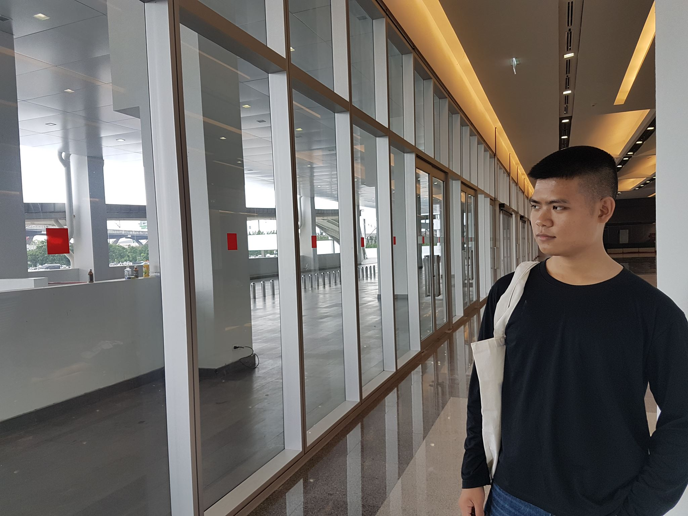

# SoulNice-Game

## บทคัดย่อ
  โปรแกรมเกมจิตวิญญาณแห่งอัศวิน(Soul Knight)เกมนี้มีจุดประสงค์เพื่อเป็นโปรแกรมเกมเพื่อความบันเทิง 
เกี่ยวกับการผจญภัยของเหล่าอัศวินโดยนำเสนอในรูปแบบของเกมสองมิติ มุมมองบุคคลที่สาม แนว RPG 
พัฒนามาจากภาษาซี และนำมาผสมผสานความคิดสร้างสรรค์ของผู้จัดทำ โดย เราได้รับบทเป็นอัศวิน 
ซึ่งมีหลากหลายอาชีพให้เราเลือก ผจญภัยไปในด่านต่างๆ โดยจะมี event 
หรือจุดมุ่งหมายให้ตัวละครพิชิตจุดมุ่งหมาย โดยวิธีการสะสม Item 
ในด่านต่างๆเพื่อจะไปสู่จุดมุ่งหมาย ในการผจญภัยจะพบกับความตื่นเต้นเร้าใจต่างๆ 
จนถึงจุดสิ้นสุดของเกม ซึ่งคอมพิวเตอร์หรือฝ่ายศัตรูที่จะมีการตัดสินใจด้วยตนเองหรอระบบ AI(Artificial Intelligence)หรือ ปัญญาประดิษฐ์ 
เพื่อให้เล่นไม่เบื่อในการเล่นเกม และเพื่อความสนุกสนานความบันเทิงของผู้ใช้โปรแกรมอีกด้วย
โดยเกมจะจบหรือผู้เล่นชนะก็ต่อเมื่อผู้เล่นได้ผ่านการผจญภัยจนภารกิจทุกอย่างเสร็จสมบูรณ์
## ลิงค์สาธิตการทำงานของเกม
- https://www.youtube.com/watch?v=16-bthrSE1s&feature=youtu.be
## วิธีการเข้าเล่นเกม
- ดาวน์โหลดไฟล์ทั้งหมด
- เปิดไฟล์ Soul Nice [EXECUTABLE]
- เปิดเกม Soul Nice

## ตัวละคร
- 1.Knight

- 2.Rogue

## วิธีการเล่น
 - กด W A S D เพื่อเคลื่อนที่
 - กด Space เพื่อเข้าประตูด่านต่อไปและเก็บของ
 - กด เม้าส์ซ้าย เพื่อยิง

## สมาชิกในกลุ่ม
| | รหัสนักศึกษา        | ชื่อ | นามสกุล |
|:-:| :-------------: |:----------:|:--------:|
|  | 61070098    | นายนรวิชญ์ | มานะพัฒนานุกูล |
|  | 61070134    | นายพัชร์ชวิชญ์ | หมื่นสุนทร |
|  | 61070225    | นายศุภธัช | จิรพงษ์ปกรณ์ |
 | 61070256    | นายอนาวิล | บางเทศธรรม |

## อาจารย์ที่ปรึกษา
- ดร. ปานวิทย์ ธุวะนุติ

รายงานนี้เป็นส่วนหนึ่งของวิชา Computer Programming 
เทคโนโลยีสารสนเทศ สถาบันเทคโนโลยีพระจอมเกล้าเจ้าคุณทหารลาดกระบัง
